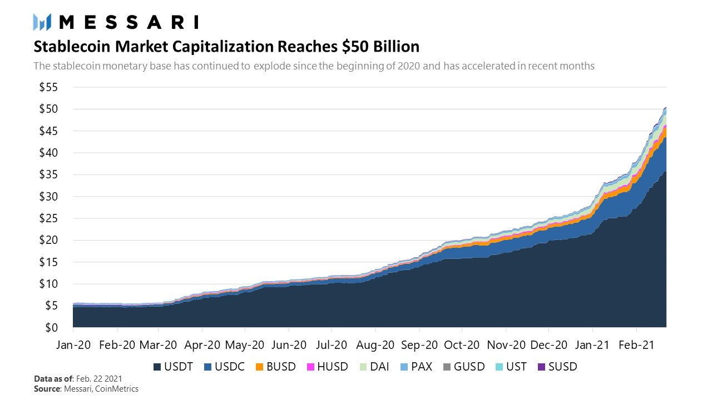

# DeFi 2.0 and Gold Backed Token as Yield Bearing Digital Asset

$GODL gold-backed cryptocurrency, a digital asset whose value is fully insured, including for coverage of embezzlement and terrorism.

We provide Stakeholders with Evidence of Insurance certificate (EOI), issued as an NFT. The EOI is issued in the wallet address of the stakeholder and confirms the value insured at the Treasury equivalent price in gold of 1 Kilo of Gold.&#x20;

Each GLYD Token defines a single one of its tokens arbitrarily as having an equivalent worth of 1KG of gold, and this equivalent will be present in the reserves/vaults as individual, segregated and allocated custody storage. This is in contrast to many banks and other storage services, which often only offer unsegregated and/or unallocated storage, especially for larger quantities.

Some gold-backed tokens even allow for the redemption of the tokens back for gold.&#x20;

Unlike most cryptocurrencies that have speculative value, a gold-backed token’s value is tied to a tangible asset, which cushions it against severe price fluctuations and because of this makes the optimal use case for an algorithmic reserve currency as the first numismatic depiction of gold with the [lion's seal](https://coinweek.com/wp-content/uploads/2020/04/1059602\_\_54666.1587475207.jpg) in Lydia 500BCE.&#x20;

The majority of gold-backed cryptocurrencies exist as ERC-20 standard tokens, although there are exceptions such as Paxos’ PAX Gold.&#x20;

Blockchain-based digital assets backed by gold and other real-world scarce commodities are becoming increasingly appealing for investors looking to hedge their portfolios against weakening fiat currencies or regulation-bound stablecoins.&#x20;

The biggest advantage that digital versions of gold hold over their physical counterparts is that they can be divided into any small unit or amount and transferred to another party as well as being bought by other protocols or investors as a hedge against inflation or crisis. we assume is the most predictable asset with regard to its use as money.

&#x20;or if you really want to hold your assets we will send you kilos of gold.

Gold-backed cryptocurrencies have, however, historically struggled with systemic issues, such as:

a) low liquidity (as they aren’t generally traded across many exchanges);&#x20;

b) ascertaining the proof of reserves (determining whether the company has the claimed reserves and gold backing or not);&#x20;

c) a dependence on central parties for collateral safekeeping and auditing, which practically defeats their purpose as “cryptocurrencies,” as one of the necessary properties of cryptocurrencies is decentralization.

Decentralised Reserve Banking and algorithmic stablecoin’s:

* market potential
* issues
* renaissance
* most promising projects

Why should you care about algorithmic stablecoins in the first place?

1\) In the past 12 months stablecoins have transacted $1.5 trillion in volume and are on pace for over $1 trillion in Q1 2021 alone.

.jpg>)

2\) Last week the total market capitalization of stablecoins surpassed $50 billion as users continue to demand stable means of storing and transferring value on public blockchains.

But the above is the just the beginning of the story.

Stablecoins are one of the few applications of public blockchains that legitimately have a multi-trillion dollar addressable market.

3\) With the US dollar accounting for about 55% of the world’s international transactions, savings, and borrowing, there is large structural global demand for USD, especially outside the US financial system. [https://www.linkedin.com/pulse/money-credit-debt-ray-dalio/](https://www.linkedin.com/pulse/money-credit-debt-ray-dalio/)

4\) Stablecoins are uniquely positioned to service this offshore dollar demand by providing individuals and businesses globally with easy access to dollars due to stablecoins being natively digital, globally accessible, and relatively more seizure resistant. [https://web.archive.org/web/20201108192443/https://unexpected-values.com/crypto-dollars/](https://web.archive.org/web/20201108192443/https://unexpected-values.com/crypto-dollars/)

5\) While the size of the offshore dollar market (dollars deposits held outside the US) is difficult to estimate, data from the BIS suggests it could be over $57 trillion dollars.

It may sound crazy, but this is the market stablecoins are beginning to eat into.

But while stablecoins have seen great adoption within crypto so far, and are powerful in their current state, they’re far from perfect.

The leading stablecoins by market capitalization today are centralized (e.g. USDT) and expose their holders to censorship, seizure, and counterparty risk.

The above properties make these stablecoins less socially scalable and less reliable.

On the other hand we have decentralized stablecoins which while have also shown great progress are not perfect either.

They’re often capital inefficient, governance heavy, difficult to scale, and in some cases unstable (like the first generation algorithmic stablecoins).

So where does this algorithmic stablecoin Renaissance, powered by the idea of protocol owned collateral come in?
