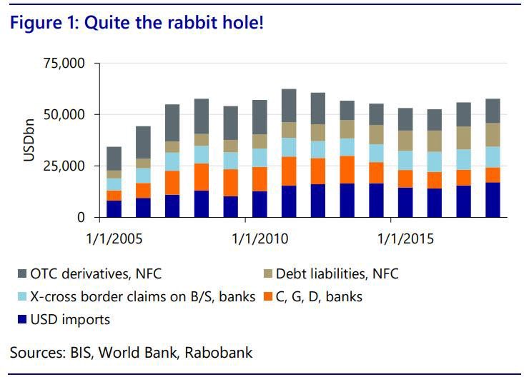

# DeFi 2.0 and Gold Backed Token as Yield Bearing Digital Asset

$GODL gold-backed cryptocurrency, a digital asset whose value is fully insured, including for coverage of embezzlement and terrorism.

We provide Stakeholders with Evidence of Insurance certificate (EOI), issued as an NFT. The EOI is issued in the wallet address of the stakeholder and confirms the value insured at the Treasury equivalent price in gold of 1 Kilo of Gold.&#x20;

Each GLYD Token defines a single one of its tokens arbitrarily as having an equivalent worth of 1KG of gold, and this equivalent will be present in the reserves/vaults as individual, segregated and allocated custody storage. This is in contrast to many banks and other storage services, which often only offer unsegregated and/or unallocated storage, especially for larger quantities.

Some gold-backed tokens even allow for the redemption of the tokens back for gold.&#x20;

Unlike most cryptocurrencies that have speculative value, a gold-backed token’s value is tied to a tangible asset, which cushions it against severe price fluctuations and because of this makes the optimal use case for an algorithmic reserve currency as the first numismatic depiction of gold with the [lion's seal](https://coinweek.com/wp-content/uploads/2020/04/1059602\_\_54666.1587475207.jpg) in Lydia 500BCE.&#x20;

The majority of gold-backed cryptocurrencies exist as ERC-20 standard tokens, although there are exceptions such as Paxos’ PAX Gold.&#x20;

Blockchain-based digital assets backed by gold and other real-world scarce commodities are becoming increasingly appealing for investors looking to hedge their portfolios against weakening fiat currencies or regulation-bound stablecoins.&#x20;

The biggest advantage that digital versions of gold hold over their physical counterparts is that they can be divided into any small unit or amount and transferred to another party as well as being bought by other protocols or investors as a hedge against inflation or crisis. we assume is the most predictable asset with regard to its use as money.

&#x20;or if you really want to hold your assets we will send you kilos of gold.

Gold-backed cryptocurrencies have, however, historically struggled with systemic issues, such as:

a) low liquidity (as they aren’t generally traded across many exchanges);&#x20;

b) ascertaining the proof of reserves (determining whether the company has the claimed reserves and gold backing or not);&#x20;

c) a dependence on central parties for collateral safekeeping and auditing, which practically defeats their purpose as “cryptocurrencies,” as one of the necessary properties of cryptocurrencies is decentralization.

Decentralised Reserve Banking and algorithmic stablecoin’s:

* market potential
* issues
* renaissance
* most promising projects

Why should you care about algorithmic stablecoins in the first place?

1\) In the past 12 months stablecoins have transacted $1.5 trillion in volume and are on pace for over $1 trillion in Q1 2021 alone.

.jpg>)

2\) Last week the total market capitalization of stablecoins surpassed $50 billion as users continue to demand stable means of storing and transferring value on public blockchains.

But the above is the just the beginning of the story.

Stablecoins are one of the few applications of public blockchains that legitimately have a multi-trillion dollar addressable market.

3\) With the US dollar accounting for about 55% of the world’s international transactions, savings, and borrowing, there is large structural global demand for USD, especially outside the US financial system. [https://www.linkedin.com/pulse/money-credit-debt-ray-dalio/](https://www.linkedin.com/pulse/money-credit-debt-ray-dalio/)

4\) Stablecoins are uniquely positioned to service this offshore dollar demand by providing individuals and businesses globally with easy access to dollars due to stablecoins being natively digital, globally accessible, and relatively more seizure resistant. [https://web.archive.org/web/20201108192443/https://unexpected-values.com/crypto-dollars/](https://web.archive.org/web/20201108192443/https://unexpected-values.com/crypto-dollars/)

5\) While the size of the offshore dollar market (dollars deposits held outside the US) is difficult to estimate, data from the BIS suggests it could be over $57 trillion dollars.

It may sound crazy, but this is the market stablecoins are beginning to eat into.

But while stablecoins have seen great adoption within crypto so far, and are powerful in their current state, they’re far from perfect.

The leading stablecoins by market capitalization today are centralized (e.g. USDT) and expose their holders to censorship, seizure, and counterparty risk.

The above properties make these stablecoins less socially scalable and less reliable.

On the other hand we have decentralized stablecoins which while have also shown great progress are not perfect either.

They’re often capital inefficient, governance heavy, difficult to scale, and in some cases unstable (like the first generation algorithmic stablecoins).

So where does this algorithmic stablecoin Renaissance, powered by the idea of protocol owned collateral come in?

The Algorithmic Stablecoins Renaissance Following a mini hype cycle in Q4 2020, algorithmic stablecoins crashed violently and entered a long trough of disillusionment early this year. But we’re seeing a renaissance in the sector today, powered by two new innovations: fractional reserve stablecoins and “protocol controlled value.” First though, what do we even mean by algorithmic stablecoins? WE’RE HIRING DEVELOPERS! MESSARI.IO/CAREERS 119 Here’s an excerpt from a thematic research piece we published on the sector earlier this year: “Most first generation algorithmic stablecoins trace their origins to a paper written in 2014 by Robert Sams titled “A Note on Cryptocurrency Stabilisation: Seigniorage Shares.” Sams described a stablecoin model which involved two tokens: a stablecoin and a token that shares in the system’s seigniorage (profit from new issuance). When demand for a stablecoin increases, the price of that stablecoin rises above $1.00 (expansion) and the supply of stablecoins must increase. New issuance is distributed to “shareholders” until demand is met and the price comes back to the $1.00 equilibrium. The opposite happens when demand falls. When the price of the stablecoin falls below $1.00 (contraction) stablecoins are removed from circulation through a burn mechanism in exchange for the issuance of new seigniorage shares. What this model does is effectively bifurcate the system into a speculative asset that absorbs volatility and backstops the system, and a stable asset that is the object of stabilization.” This sounds simple and effective on paper, but brings up two obvious limitations: downward reflexivity can create “bank runs” on these protocols, and the lack of collateral backstop means the bank can legitimately go to zero. Reflexivity propelled early experiments (ESD, Frax) to great heights, then annihilated them on the way down. Seigniorage shares in these systems are only worth something if buyers believe in the ongoing viability of the systems and the positive net present value of their future monetary supply. When heavy redemptions hit quickly, it crushes confidence and chills reinvestment in the share tokens, causing a death spiral. Without any collateral backstop to offset the spiral, algorithmic stablecoins are dependent on outside “lenders of last resort” to bail them out during severe contractions. Users (bag holders) need to step in to save the system, or the shares and stablecoin will fade to oblivion. Then there’s the bootstrapping challenge. You need to reach a sufficient level of market capitalization and bootstrap enough liquidity to ensure fluctuations in demand won’t cause significant volatility in the stablecoin. However, in the absence of genuine early demand for a given stablecoin, you need to manufacture that demand through incentives to speculators. That speculation fuels reflexivity, but the more reflexive a stablecoin is, the less stable and useful it is, and the greater the perceived risk of a future liquidity crisis in the protocol. Fractional reserve models and “protocol controlled value” have changed the calculus for algorithmic stablecoins. Fractional reserve stablecoins (pioneered by Frax Protocol) build upon the idea that there is a sweet spot between overcollateralized and pure algorithmic stablecoins that allow for a scalable, capital efficient, decentralized stable value asset. The fractional reserves dampen reflexivity during periods of contraction, offering stablecoin holders 1:1 convertibility between stablecoins and underlying collateral, and generally provide greater confidence in the peg compared to purely algorithmic models. In the year since Frax’s launch, it’s reached $1 billion in circulation, and has maintained a tight peg throughout the year, including the May crash. Protocol controlled value (PCV) was pioneered by Fei Protocol, which functions similarly to a giant MakerDAO vault. What makes Fei different is that its protocol owns the assets users deposit to the system, not the individual LPs of the vault’s collateral. FEI is not a loan against collateral so much as it’s effectively a sale of collateral assets in exchange for a stablecoin. The system features two assets - Tribe (a governance token that can provide a backstop in “bank runs” similar to MKR) and FEI (the stablecoin). Fei is able to WE’RE HIRING DEVELOPERS! MESSARI.IO/CAREERS 120 do virtually whatever it wants with its treasury assets (much like a depositor-governed bank) once they are deposited. Fei can deploy balance sheet capital into lending and staking pools across DeFi or buy other reserves. That flexibility has created organic demand for its stablecoin and reduced reflexivity (so far). It’s unclear if these improvements will be enough to challenge DAI for decentralized stablecoin supremacy, but the iterations in Fei and Frax seem like a step in the right direction. 4. The Emergence of Non Pegged Stablecoins When bitcoin was born, it captured the imagination of its early adopters who began to seriously consider the potential for non-sovereign digital currencies. Bitcoin’s promise as a currency was long-term - it would likely remain volatile for a long time, but its believers thought it would eventually stabilize once it built its user population and liquidity. To this day, bitcoin remains incredibly volatile - it plunged more than 30% in a single day this May despite its $750 billion market cap - and it’s unclear whether BTC will ever achieve stability given its inflexible supply. The builders of the crypto economy aren’t waiting for bitcoin to stabilize. To bridge the gap, we’ve witnessed a rise in dollar-pegged stablecoins that solve crypto’s volatility bug and catalyze adoption for blockchain applications beyond HODLing. But early iterations have presented a new problem - stablecoins have dollarized our blockchains, and have put the entire crypto-economy at systemic risk in the process. A currency ultimately pegged to and controlled by the Fed and Treasury, limits our ability to build a truly sovereign monetary system. Source: Fei Website WE’RE HIRING DEVELOPERS! MESSARI.IO/CAREERS 121 That’s what led to the launch of a new wave of projects this year, aimed at creating free-floating stablecoins which are unpegged to fiat currencies. Non-pegged stablecoins offer an opportunity for the crypto economy to achieve stability while eliminating its dollar dependence. The controversial, but indisputable leader of this movement is Olympus DAO. Launched in March 2021, Olympus incentivizes users to “bond” tokens (Dai, ETH, LP tokens, etc.) to its protocol permanently in exchange for a new token called OHM. The protocol attracts liquidity by offering OHM at a discount to the value of the collateral received, though newly issued OHM can only be redeemed at par value after a vesting period. The game theory has been powerful so far - in eight months since its fair launch, Olympus has accumulated $700 million in treasury assets, and rocketed to $3.5 billion in market cap. Olympus DAO is now a behemoth with a hand in multiple sectors of DeFi, as it’s realized a significant premium thanks to the faith its users have in the protocol’s ability to conduct effective monetary policy at scale. If Olympus DAO were to accrue a treasury worth tens of billions of dollars, it might have the resources to stabilize a $100 billion non-pegged stablecoin, much like how central banks around the world stabilize their own currencies. Source: Daniel Cheung If all this sounds weird to you, you’re not alone. Non pegged stablecoins are undeniably a lot to wrap your head around and deserve skepticism. There are ponzi-like game theory attributes of the protocol that drive interest and participation, and it’s unclear how those will hold up amidst a broader crypto selloff. However, judging by the number of forks it has spawned, OlympusDAO may be the year’s most important new project, and non-pegged stablecoins may be the best bet this industry has when it comes to de-pegging from the US dollar.
